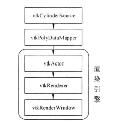
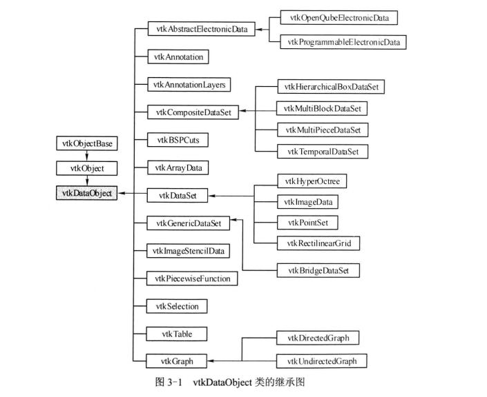
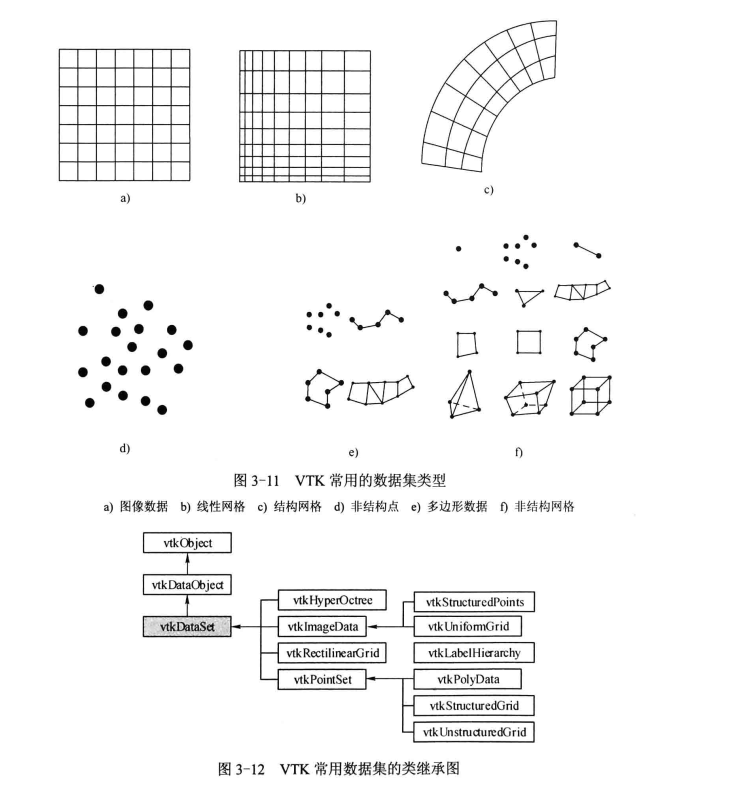
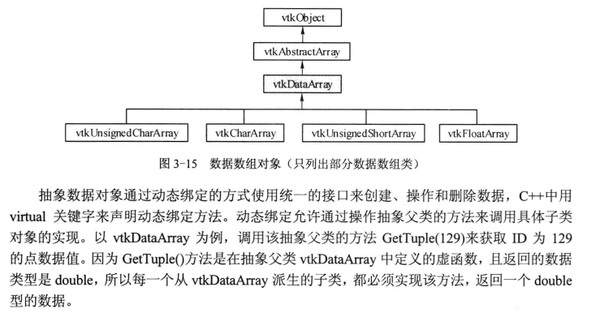
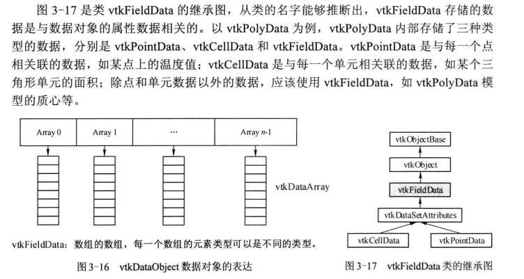

# Learn VTK
## 1、初识VTK
VTK最初是教科书The Visualization Toolkit An Object-Oriented Approach to 3D Graphics的部分。威尔・施罗德、肯・马丁和比尔・洛伦森――三名图形和可视化研究人员――从1993年12月开始，在他们自己的时间编写了这本书和配套软件，并得到了他们当时的雇主通用电气研发公司的法律许可。这本书的动机是与其他研究人员合作，开发一个开放的框架来创建前沿的可视化和图形应用程序。
VTK源于作者在通用电气的经验，特别是LYMB面向对象的图形系统。其他影响包括由施罗德等人开发的视觉可视化系统。伦斯勒理工学院开发的面向对象的计算机动画系统；以及比尔・洛伦森合著的面向对象建模与设计书。
在VTK的核心被编写出来之后，世界各地的用户和开发人员开始改进系统并将系统应用于现实世界的问题。特别是，通用电气医疗系统公司和其他通用电气业务对该系统做出了贡献，佩妮・莱茵汉斯博士等研究人员开始用这本书进行教学。其他早期的支持者包括洛斯阿拉莫斯国家实验室的吉姆・阿伦斯和慷慨的石油和天然气支持者。
为了创建一个大的，活跃的，全球社区，肯和威尔连同丽莎阿维拉，查尔斯法律和比尔・霍夫曼离开通用电气在1998年创建Kitware公司.从那时起，成百上千的额外的开发人员把VTK变成现在世界上首屈一指的可视化系统。例如，Sandia国家实验室一直是一个强有力的支持者和共同开发者，他们改进了VTK中的2D图表和信息可视化。


VTK的主要特点包括：

- 跨平台：VTK可以在多种操作系统上运行，包括Windows、Linux、Mac OS X等。
- 开源：VTK是开源软件，可以自由地使用、修改和分发。
- 丰富的功能：VTK提供了丰富的功能，包括数据读取、数据转换、数据可视化、图像处理等。
- 强大的社区支持：VTK有一个活跃的社区，提供了大量的文档、教程和示例代码，可以帮助用户快速上手和使用VTK。
- 易于扩展：VTK的设计使得用户可以很容易地添加新的功能或模块。
- 高性能：VTK使用了高效的算法和数据结构，可以处理大规模的数据和复杂的计算。
- 支持多种编程语言：VTK提供了C++、Python、Java、Tcl等语言的接口，用户可以根据自己的需求选择合适的编程语言。
- 支持多种数据格式：VTK支持多种数据格式，包括VTK、STL、OBJ、PNG、JPEG等，可以方便地读取和保存各种类型的数据。
- 支持多种可视化技术：VTK提供了多种可视化技术，包括体绘制、表面绘制、切片、点云绘制等，可以满足各种可视化需求。
- 支持多种交互方式：VTK提供了多种交互方式，包括鼠标、键盘、触摸屏等，可以方便地与用户进行交互。

## 2、一个简单的VTK程序
```c++
#include <vtkSmartPointer.h>
#include <vtkRenderWindow.h>
#include <vtkRenderer.h>
#include <vtkRenderWindowInteractor.h>
#include <vtkPolyDataMapper.h>
#include <vtkActor.h>
#include <vtkCylinderSource.h>
#include <vtkProperty.h>
#include <vtkCamera.h>
#include <vtkInteractorStyleTrackballCamera.h>


int main()
{
    // 创建一个柱体数据源
    vtkSmartPointer<vtkCylinderSource> cylinder = vtkSmartPointer<vtkCylinderSource>::New();
    cylinder->SetHeight(3.0);
    cylinder->SetRadius(1.0);
    cylinder->SetResolution(10);//set 分辨率


    // 创建一个多边形数据映射器
    vtkSmartPointer<vtkPolyDataMapper> mapper = vtkSmartPointer<vtkPolyDataMapper>::New();
    mapper->SetInputConnection(cylinder->GetOutputPort());

    // 创建一个演员
    vtkSmartPointer<vtkActor> actor = vtkSmartPointer<vtkActor>::New();
    actor->SetMapper(mapper);

    // 创建一个渲染器
    vtkSmartPointer<vtkRenderer> renderer = vtkSmartPointer<vtkRenderer>::New();
    renderer->AddActor(actor);

    // 创建一个渲染窗口
    vtkSmartPointer<vtkRenderWindow> renderWindow = vtkSmartPointer<vtkRenderWindow>::New();
    renderWindow->AddRenderer(renderer);

    // 创建一个渲染窗口交互器
    vtkSmartPointer<vtkRenderWindowInteractor> interactor = vtkSmartPointer<vtkRenderWindowInteractor>::New();
    interactor->SetRenderWindow(renderWindow);

    // 启动渲染窗口交互器
    interactor->Initialize();
    interactor->Start();

    return 0;
}
```
这个程序创建了一个球体，并将其显示在一个渲染窗口中。程序首先创建了一个球体数据源，然后创建了一个多边形数据映射器，将球体数据源连接到映射器中。接着创建了一个演员，将映射器连接到演员中。然后创建了一个渲染器，将演员添加到渲染器中。接着创建了一个渲染窗口，将渲染器添加到渲染窗口中。最后创建了一个渲染窗口交互器，将渲染窗口连接到交互器中，并启动交互器。

vtkActor类表示一个可以渲染的物体，vtkPolyDataMapper类将数据源转换为可以渲染的格式，vtkRenderer类表示一个渲染场景，vtkRenderWindow类表示一个渲染窗口，vtkRenderWindowInteractor类表示一个渲染窗口交互器。
vtkActor派生自vtkProp类，渲染场景中数据的可视化通过vtkProp类实现，vtkProp类派生自vtkObject类，vtkObject类是VTK中所有类的基类。如若要选软一个柱体，柱体的数据是vtkPolyData，数据要在场景中渲染时，不是直接将该数据加入渲染场景，而是以vtkProp的形式存在于渲染场景中，三维中最常用的vtkProp子类有vtkActor(几何数据)和vtkVolume(体数据)。vtkProp的子类负责确定渲染场景中的位置、大小、方向等信息，prop依赖于两个对象，一个是Mapper，另一个是Property。Mapper负责将数据转换为可以渲染的格式，存放数据和渲染信息，Property负责确定渲染场景中的颜色、材质、光照等信息。Mapper是可视化管线的末端。

## 2.2 三维场景的基本要素
### 2.2.1 灯光
VTK中使用类vtkLight来表示渲染场景中的光源，可以使用vtkLight来设置光源的属性，vtkLight实例可以打开、关闭，设置灯光的颜色、照射位置（焦点）、灯光所在的位置，强度等。

vtkLight可以分成两类：点光源（Position Light 位置光源/聚光灯）和平行光源（Direction Light 方向光源）。点光源是向各个方向均匀发射光线，可以指定灯光的衰减值、锥角等，而平行光源是指光源在无穷远处，因此将光线视为平行。

光源的位置和焦点的连线定义光线的方向，默认vtkLight为平行光源。
常用的方法有:
```c++
void SetColor(double r, double g, double b); //设置光源的颜色
void SetPosition(double x, double y, double z); //设置光源的位置
void SetFocalPoint(double x, double y, double z); //设置光源的焦点
void SetIntensity(double intensity); //设置光源的强度
void SetConeAngle(double angle); //设置光源的锥角
void SetAttenuation(double constant, double linear, double quadratic); //设置光源的衰减值
void SetLightTypeToPositional(); //设置光源为点光源
void SetLightTypeToDirectional(); //设置光源为平行光源
```
示例见:[ch02_2_RenderCylinder_light.cpp](ch02_2_RenderCylinder_light.cpp)

该示例定义了链哥哥vtkLight对象，一个为绿色光，位置在(0,0,1)，一个为蓝色光，位置在(0,0,1-1)焦点都对这相机的焦点。最后用vtkRenderer将灯光对象加载进渲染场景中。一个vtkRenderer可以有多个灯光，因此使用的是vtkRenderer::AddLight()方法。

### 2.2.2 相机


### 2.2.3 颜色
### 2.2.4 纹理映射


## 2.3 坐标系统及空间变换
在图形学中，坐标系统主要有：Model坐标系统、World坐标系统、View坐标系统、Display坐标系统。
两种表示座标点的方式：以屏幕像素值为单位和归一化坐标值（取值范围[-1, 1]）；

- Model坐标系统是定义模型时的坐标系统，为局部的笛卡儿坐标系；
- World坐标系统是放置Actor的三维空间坐标系，vtkActor类负责将Model坐标系统变换到World坐标系统。World坐标系统只有一个，也是相机和灯光所在的坐标系统；
- View坐标系统是相机所看到的坐标系统，XYZ轴的取值范围为[-1,1]。相机类负责将World坐标系统变换到view坐标系统；
- Display坐标系统与View坐标系统相似，但取值范围不是[-1,1]，而是屏幕/窗口的像素值；

以上几种坐标系统之间的变换由VTK自动完成，由类vtkCoordinate完成。

### 2.3.2空间变换
**待补充**

## 2.4 VTK管线
渲染引擎主要负责数据的可视化表达，如前面用到的vtkCamera、vtkLight、vtkProp等。还有一个重要概念就是可视化管线，是指用于获取或创建数据、处理数据以及把数据写入文件或把数据传递给渲染引擎进行显示。
可视化管线的三个基本要素为：
- **数据对象 Data Object**
- **处理对象 Process Object**
- **数据流方向 Direction of Data Flow**

VTK管线中数据流方向为从数据对象到渲染对象，数据对象通过处理对象进行变换，处理对象包括vtkMapper、vtkRenderer等，处理对象将数据对象转换为渲染对象，渲染对象通过渲染器进行渲染。




    

# 3、VTK基本数据结构
若将VTK可视化管线视作一个工厂，那么VTK的数据结构就是生产必备的原材料。VTK具有丰富的数据结构。
## 3.1 可视化数据的基本特点
可视化数据具有以下几个特点：
- 离散性：对无限的、连续的空间进行采样，生成有限的采样数据点，这些数据以离散点的形式存储。由于点与点之间的值是不可知的，所以需要通过插值的方式获取，如线性插值、非线性插值的方法。
- 数据具有规则或不规则的结构（结构化与非结构化），规则的数据点之间具有固定的关联关系，不必存储所有的数据点，只需要存储起始点、相邻点以及总点数即可保存完整的数据信息。不规则结构的数据没有固定的关联关系，在数据表达时更自由。
- 数据具有维度：可视化数据是具有拓扑维度的，零维为点，三维为体等，数据的维度决定了数据可视化的方法。
## 3.2 数据对象和数据集
### 3.2.1 VTKDataObject
在VTK中，数据一般以数据对象（Data Object, 类vtkDataObject）形式表现。

### 3.2 vtkDataSet
将数据对象组织成一种结构并赋予相应的属性值，就形成了数据集（DataSet，类vtkDataSet）。vtkDataSet由两部分组成：组织结构(Organizing Structure)和与组织结构相关联的属性数据(Attributes Data)。
vtkDataSet的组织结构由拓扑结构（Topology）、几何结构(Geometry)两部分组成，拓扑结构描述了对象的构成形式，几何结构描述对象的空间位置。即点数据定义的坐标点构成了数据集的几何结构，点数据的连接形成单元数据，由单元数据形成了数据集合的拓扑结构。


## 3.3 单元类型
数据集由一个或多个单元组成，单元是数据集的基本组成单元，单元类型决定了单元的形状和拓扑结构。VTK中常用的单元类型有：
- 线段单元(vtkLine)
- 三角形单元(vtkTriangle)
- 四边形单元(vtkQuad)
- 多边形单元(vtkPolygon)
- 立方体单元(vtkCube)
- 球体单元(vtkSphere)
- 圆柱单元(vtkCylinder)
- 圆锥单元(vtkCone)
- 多面体单元(vtkPolyhedron)

### 3.3.1 线性单元
vtk中的单元的类型定义在vtkCellType.h文件中，vtkCellType类定义了单元类型，vtkCellType的线性单元类型如下：

- VTK_VERTEX 顶点
- VTK_POLY_VERTEX 多边形顶点
- VTK_LINE 线段
- VTK_POLY_LINE 多边形线段/折线
- VTK_TRIANGLE 三角形，点的连接方向和表面法向量符合右手法则（右手大拇指外的手指沿着点的方向弯曲，大拇指指向的方向就是表面法向量）
- VTK_TRIANGLE_STRIP 三角形条带，由一个或多个线段组合而成。而为类型，由n+2个有序点连接而成。定义三角形条带的点不需要共面，顶点顺序为：(i, i+1, i+2),0 <= i <= n.
- VTK_POLYGON 多边形，
- VTK_PIXEL 像素
- VTK_QUAD 四边形
- VTK_TETRA 四面体
- VTK_VOXEL 体素，三维的基本理性，要求相邻的两个面必须垂直
- VTK_HEXAHEDRON 六面体
- VTK_WEDGE 三角锥
- VTK_PYRAMID 四面体
- VTK_POLYHEDRON 多面体

### 3.3.2 非线性单元
vtk中非线性单元也是定义在vtkCellType.h文件中，vtkCellType的非线性单元类型如下：

- VTK_QUADRATIC_EDGE：二次曲线，一维的基本类型，由三个点定义；
- VTK_QUADRATIC_TRIANGLE：二次三角形，二维的基本类型，由六个点定义；
- VTK_QUADRATIC_QUAD：二次四边形，二维的基本类型，由八个点定义；
- VTK_QUADRATIC_TETRA：二次四面体，三维的基本类型，由十个点定义；
- VTK_QUADRATIC_PYRAMID：二次四面体/角锥体，三维的基本类型，由十三点定义；
- VTK_QUADRATIC_HEXAHEDRON：二次六面体，三维的基本类型，由二十个点定义；
- VTK_QUADRATIC_POLYGON：二次多边形，二维的基本类型，由n+3个点定义；
- VTK_QUADRATIC_WEDGE：二次三角锥，三维的基本类型，由十五个点定义；
- VTK_QUADRATIC_EDGE：二次多面体，三维的基本类型，由n+6个点定义；
...

## 3.4 数据属性
属性数据(Attribute Data)是与数据集相关联的数据，描述了数据集的几何结构、拓扑结构以及数据集的其它信息。属性数据主要用于描述数据集的属性特征，对数据集的可视化实质上就是对属性数据的可视化。
根据数据的性质，属性数据可以分为标量数据、向量数据、张量数据、纹理数据等。在VTK中，用vtkPointData类和vtkCellData类来描述数据集的属性数据，它们是类vtkDaraSetAttributes的子类。
**标量数据**：标量数据是单值数据，如温度、密度等，用vtkDataArray类来描述。vtkDataArray类是VTK中所有数据数组的基类，包括一维、二维、三维等数组，以及标量、向量、张量等数据类型。
**向量数据**：向量数据是具有方向的数据，如速度、力等，用vtkDataArray类来描述。
**张量数据**：张量数据是具有方向和大小数据，如应力、应变等，用vtkDataArray类来描述。


## 3.5 数据集类型
VTK中数据集是由组织结构和与之关联的属性数据组成，组织结构包括拓扑结构、几何结构，属性数据包括标量数据、向量数据、张量数据等。VTK中常用的数据集类型有：




- vtkImageData:按规则排列在矩形方格中的点或单元的集合，如（a）所示。排列在二维平面称为像素映射、位图、图像等，排列在三维空间称为体积数据、体素、三维图像等。由于其几何结构和拓扑结构都是规则的，所以每个点的位置可隐式表达。在图像处理、计算机图形学等广泛应用，医学图像则更多使用体数据，如CT、MRI等。

- vtkPolyData:由顶点(vertex)、多顶点(polyVertex)、线(line)、三角形条带(Triangle Strip)等单元组成的集合。如（e）所示。

- vtkRectilinearGrid:由规则排列的点和单元组成的集合，如（b）所示。拓扑结构是规则的，但其几何结构是部分规则的。

- vtkStructuredGrid：是结构化网络数据，具有规则的拓扑结构和不规则的几何结构，单元没有重叠或交叉，通常用于有限元分析。

- vtkUnstructuredGrid:是非结构化网络数据，具有非结构的拓扑结构和不几何结构，所有单元都可以从零维延伸至三维，计算时需要耗费大量资源，通常用于有限元分析。

- vtkUnstructuredPoint:不规则地分布在空间的点集。

## 3.6 数据的存储和表达
### 3.6.1 vtkDataArray
VTK中的内存分配采用连续内存，可以快速地创建、删除和遍历，称之为数据数组，用类vtkDataArray实现。数组的访问是基于索引的，与C++一样，从0开始计数。对于由多个数据分量组成的数据，如RGB，可以使用元组(tuple)来表示，元组是数据数组的子数组。

vtkDataArray及其子类是建立VTK数据对象的基础，以vtkpolyData为例，该类由几何数据(vtkPoints)、拓扑数据(vtkCellArray)和属性数据(vtkPointData、vtkCellData和 vtkFieldData)组成，这些数据通过数组(vtkDataArray及其子类)来存储和表达。


### 3.6.2 数据对象的表达
VTK里的数据对象是作为vtkDataArray的数组实现的，vtkDataObject是一种通用的可视化数据表达，可视化算法基本没有直接处理vtkDataObject类型的数据。vtkDataObject内部封装了可视化管线的执行相关的变量和方法，包括表达数据。vtkDataObject内部有一个vtkFieldData(场数据)的实例，负责对数据的表达。场数据可以看作数据数组的数组，数组里的每一个元素都是一个数组，数组的类型、长度、元组的大小、名称都可以各不相同。



# 四、VTK数据的读写

## 4.1 Reader 和 Writer类
vtk中，要将外部数据读入可视化管线，主要的步骤是：
1. 实例化vtkReader对象
2. 指定要读取的文件名
3. 调用Update方法促使管线执行，当管线后续的Fiter有Update请求时，如调用Render方法，管线就会读取相应的图像文件，所以这一步有时也可以省略。
类似的，使用Writer类的主要步骤为：
1. 实例化vtkWriter对象。
2. 输入要写盘时的数据以及指定待写盘的文件名。
3. 调用Writer()方法促使Writer()类开始写盘操作；

### 4.1.1 vtkImageData类型

图像数据在vtk中是用vtkImageData类来表示的，对于不同的图像文件类型，vtk提供相对应的类对图像文件进行读写操作。


需要注意的是，在读写RAW格式的数据时，由于该类型的图像没有文件信息，因此需要指定图像各个维度的大小、字节顺序（大端字节序或小端字节序）、存储像素值的类型信息等。


### 4.1.2 vtkPolyData类型